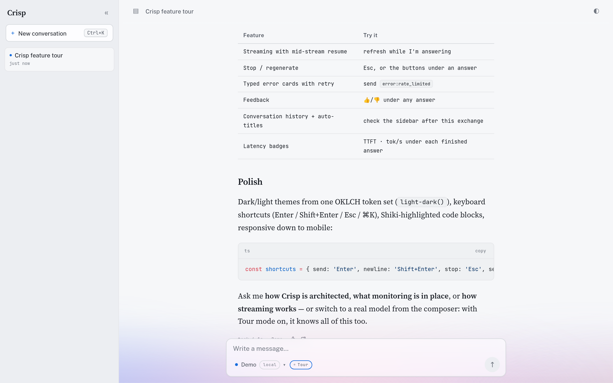

# Crisp


A small, polished multi-AI chat client. Vue 3 SPA talking to a Hono API on Bun,
streaming LLM responses over the [AG-UI protocol](https://docs.ag-ui.com/) —
from remote providers (Anthropic, OpenAI, OpenRouter) and local ones (Ollama),
plus a zero-key **Demo** model so the app works the moment it starts.

The fastest way to evaluate it is to ask it: the empty state suggests four
**Tour Questions** (features, architecture, monitoring, streaming). The Demo
model answers them from a canned script; any real model answers them from a
briefing injected as the conversation's first message while the composer's
**Tour** toggle is on (ADR-0009).

**Hosted**: <https://crisp-production-0b9e.up.railway.app> — the zero-key
Demo model is on, so the Tour works the moment the page loads. For real
models, connect OpenRouter in one click (OAuth, no key to paste), paste your
own provider key in the picker (BYOK), or connect
[your own Ollama](docs/byo-ollama.md).



## Run it

The only prerequisite is [Docker](https://docs.docker.com/get-started/get-docker/)
with Compose v2 (`docker compose version` to check — ships with Docker
Desktop and modern Docker Engine):

```sh
git clone https://github.com/ratierd/crisp.git && cd crisp
docker compose up --build
# → http://localhost:3000
```

That's the whole setup. Redis and the app start together; the Demo model needs
no keys. To light up real providers, run the interactive wizard (needs
[Bun](https://bun.sh)) — it collects provider and LangSmith keys into `.env`
(compose reads it automatically), validates them live, and helps you pull
your first local model:

```sh
bun install && bun setup
```

No Bun? Copy `.env.example` to `.env` and fill it by hand — everything in it
is optional. Inline env vars work too:
`ANTHROPIC_API_KEY=sk-... docker compose up --build`.

Remote models are also **BYOK**: a visitor pastes their own Anthropic, OpenAI,
or OpenRouter key into the model picker and chats on their own account
(ADR-0006). The fastest path is the picker's **Connect with OpenRouter**
button — an OAuth (PKCE) round-trip that mints a user-scoped key in one click,
unlocking Claude, GPT, Gemini, and DeepSeek through one account, no provider
console visit needed. The key stays in that browser's localStorage, rides each request
next to the model id, is used for that Run, and is never stored or logged
server-side.

Local models are **BYO Ollama** — always discovered and run by the _browser_,
never the server, exactly as they would be against a deployed Crisp. On
localhost a running daemon just works (Ollama allows localhost origins by
default); every installed model appears in the picker. Against a deployed
instance, allow that origin on your daemon —

```sh
OLLAMA_ORIGINS=https://crisp.example.com ollama serve   # the picker shows your exact origin
```

— and your local models appear and run straight from the browser. On HTTPS
deployments Chrome asks once for local-network permission; that's the point.
Step-by-step laptop setup (install → pull → allow origin → browser prompt):
[docs/byo-ollama.md](docs/byo-ollama.md), also served by the app itself at
[`/byo-ollama.html`](https://crisp-production-0b9e.up.railway.app/byo-ollama.html)
and linked from the picker.

To collect traces, cost, and feedback analytics in LangSmith, set
`LANGSMITH_API_KEY` (and optionally `LANGSMITH_PROJECT`) — see
[Observability](#architecture) below.

### Development

Needs [Bun](https://bun.sh) 1.3+ (runtime and package manager — no Node
required) and Docker for Redis. [Ollama](https://ollama.com/download) is
optional: install it, pull a model, and it appears in the picker (the wizard
below walks you through it).

```sh
bun install
docker compose up redis -d
bun setup                   # optional: keys, LangSmith, first local model
bun dev                     # server :3000 + vite :5173
```

| command         | what it does                                                                                |
| --------------- | ------------------------------------------------------------------------------------------- |
| `bun setup`     | interactive wizard: keys → `.env` (idempotent, secrets masked), pull a local model          |
| `bun dev`       | dev servers (Hono on :3000, Vite on :5173)                                                  |
| `bun run test`  | unit + integration tests (Vitest — `run` matters: bare `bun test` invokes Bun's own runner) |
| `bun typecheck` | strict TS across all packages                                                               |
| `bun lint`      | oxlint: correctness rules + Nx module boundaries (the hexagon is enforced, not convention)  |
| `bun format`    | oxfmt over the whole repo (`bun format:check` is the CI gate)                               |
| `bun e2e`       | Playwright smoke spec against the Demo model¹                                               |

¹ needs Redis running; on NixOS point it at a system browser:
`CRISP_E2E_BROWSER=$(which google-chrome-stable) bun e2e`.

### Environment variables

Everything is optional (`bun setup` fills these interactively; see
`.env.example` for the manual route):

| var                  | default                  | effect                                                                 |
| -------------------- | ------------------------ | ---------------------------------------------------------------------- |
| `ANTHROPIC_API_KEY`  | —                        | enables Claude models in the picker                                    |
| `OPENAI_API_KEY`     | —                        | enables GPT models in the picker                                       |
| `OPENROUTER_API_KEY` | —                        | enables OpenRouter models in the picker                                |
| `LANGSMITH_API_KEY`  | —                        | traces every Run to LangSmith; feedback lands on traces                |
| `LANGSMITH_PROJECT`  | `crisp`                  | LangSmith project name                                                 |
| `LANGSMITH_ENDPOINT` | US host                  | set `https://eu.api.smith.langchain.com` for EU accounts               |
| `REDIS_URL`          | `redis://localhost:6379` | run-stream buffer (required)                                           |
| `DB_PATH`            | `./data/crisp.sqlite`    | conversation storage                                                   |
| `PORT`               | `3000`                   | API port                                                               |
| `CRISP_DEMO`         | on                       | `off` hides the zero-key Demo model (forces visitors onto real models) |
| `CRISP_RATE_LIMIT`   | on                       | `off` disables per-IP rate limiting (e2e, local load testing)          |

## What it does

- **The product gives its own tour**: the empty-state chips ask Crisp about
  itself. With **Tour mode** on (composer toggle, default on), a new
  conversation opens with a persisted system-message briefing, so the model
  you picked — remote or your own Ollama — answers accurately; the transcript
  discloses it behind a "Tour context attached" note. The Demo model answers
  from a canned script instead (ADR-0009).
- **Streaming chat** over AG-UI events (SSE), with markdown + Shiki-highlighted
  code blocks rendered incrementally — only the growing tail block re-renders.
- **Model picker with health gating**: `GET /api/models` doubles as a health
  check; a dead provider's models stay visible but disabled, with a hint
  explaining why (missing key), and the picker shows the one-line command
  that connects your own Ollama.
- **BYOK — bring your own key**: paste your Anthropic / OpenAI / OpenRouter
  key in the picker — or click **Connect with OpenRouter** to mint one via
  OAuth in a single click — and the disabled models light up; your chats (and
  their auto-titles) bill your account. Keys live in your browser only, travel
  per-request, and are never persisted or logged server-side (ADR-0006).
- **Mid-stream resume**: refresh the page while the model is answering and the
  stream reattaches and keeps writing. Runs execute detached from the HTTP
  request; a dropped connection doesn't kill generation.
- **Stream controls**: stop (Esc), regenerate, retry on typed error cards
  (`provider_unavailable` / `auth_failed` / `rate_limited` / `aborted` / `unknown`).
- **Conversations**: SQLite-persisted history, auto-titled after the first
  exchange by the model that answered.
- **BYO Ollama**: local models are always the _browser's_ job — it discovers
  and runs the user's own daemon directly, in dev and deployed alike; the
  model list, streaming, stop, regenerate, and feedback all work identically
  to server runs. The picker shows the one-line `OLLAMA_ORIGINS` command
  that opts your daemon in (localhost origins need no config).
- **Observability (LangSmith)**: set `LANGSMITH_API_KEY` and every Run —
  remote, local, demo, stopped, failed — becomes a trace with token usage and
  cost; conversations group as Threads; thumbs up/down (with an optional
  "what went wrong" note) attaches to the exact trace as feedback.
- **Feedback**: 👍/👎 on every answer — toggleable, retractable, per
  regeneration attempt, persisted with the message.
- **Polish pack**: dark/light from one OKLCH token set (`light-dark()`),
  keyboard shortcuts (Enter / Shift+Enter / Esc / ⌘K), per-message latency
  badges (time-to-first-token · tok/s), responsive down to mobile, and an
  aurora drifting under the frosted-glass composer — it fades out of the way
  while you read history.

## Architecture

Nx monorepo, pragmatic hexagonal, organized as **feature slices** (ADR-0008):
one lib per user-visible capability, each owning its wire contracts (zod
schemas both runtimes validate against), the ports it consumes, and its
behavior — no IO. Adapters know _how_ tonight's infrastructure does it.

```
apps/
  web/       Vue 3 + Vite SPA — @crisp/ai/vue useChat, Pinia for app state
  server/    Hono on Bun — one route module per slice + the composition root
    src/routes/  conversations, runs, feedback, models
    src/infra/   @crisp/ai gateway, bun:sqlite repo, Redis Streams store, LangSmith
libs/
  ai/        in-house AG-UI client (ADR-0003): chat orchestrator, provider adapters, SSE, useChat
  features/
    conversations/  Conversation + Message schemas, CRUD service, ConversationRepository port
    runs/           chat + BYO wire schemas, RunService, ModelGateway/MessageStore/RunStreamStore/RunMirror ports
    titling/        auto-titling service, TitleModel + ConversationRenamer ports
    feedback/       Feedback schemas, FeedbackService, FeedbackStore + FeedbackSink ports
    models/         Model schemas + registry, KeyConfig port
```

Two rules, both lint-enforced (`bun lint`): cross-slice, a feature is
reachable through its `/contracts` entry only — the full interface (service +
ports) is for the composition root in `apps/server`. And every port is
**consumer-owned**: declared in the slice that calls it, sized to exactly what
it uses. Structural typing then lets one adapter serve many slices — the
SQLite repository satisfies four slices' ports, the ai gateway two:

| port (owning slice)                      | job                                                     | adapter                                                                                                          |
| ---------------------------------------- | ------------------------------------------------------- | ---------------------------------------------------------------------------------------------------------------- |
| `ModelGateway` (runs)                    | start a Run against any Model, regardless of Provenance | `@crisp/ai` provider adapters + mock Demo provider, wrapped by a LangSmith tracing decorator when the key is set |
| `TitleModel` (titling)                   | run a Model for one title                               | the same gateway, seen narrower                                                                                  |
| `ConversationRepository` (conversations) | durable Conversations: create, read, list, delete       | `bun:sqlite`                                                                                                     |
| `MessageStore` (runs)                    | write a Run's outcome into a Conversation               | the same SQLite adapter                                                                                          |
| `ConversationRenamer` (titling)          | apply a generated title                                 | the same SQLite adapter                                                                                          |
| `FeedbackStore` (feedback)               | pin a verdict to the Message a Run produced             | the same SQLite adapter                                                                                          |
| `RunStreamStore` (runs)                  | buffer live Run events for reattach                     | Redis Streams                                                                                                    |
| `FeedbackSink` (feedback)                | mirror thumbs votes to observability                    | LangSmith feedback API                                                                                           |
| `RunMirror` (runs)                       | record browser-executed (BYO) Runs post-hoc             | LangSmith run API                                                                                                |
| `KeyConfig` (models)                     | which providers the server holds keys for               | process env                                                                                                      |

Observability never touches the slices: tracing is a _decorator_ on
`ModelGateway`, so without `LANGSMITH_API_KEY` the app composes exactly as it
did before the feature existed.

The flow for one message: the client POSTs the AG-UI payload to `/api/chat`.
The server starts the Run **detached**, teeing every event into Redis; the
HTTP response merely replays that stream. On completion the exchange is
persisted to SQLite. If the client vanishes mid-run, the run finishes anyway —
reloading replays the buffered events and tails the rest live.

### Decisions & tradeoffs

Recorded as they were made, in [docs/adr/](docs/adr/) and
[docs/plan.md](docs/plan.md). The ones worth calling out:

- **AG-UI events cross the hexagon untranslated** (ADR-0002). AG-UI is an open
  protocol, not a vendor SDK type — translating it to "domain events" and back
  in the riskiest code path (stream handling) would be busywork with bug
  surface. The slices only inspect event discriminants.
- **Redis for resumable runs** (ADR-0001). An in-process buffer would demo the
  same thing with zero infrastructure; Redis was chosen deliberately.
  Replay is cross-instance by construction; stop and SQLite currently pin
  the app to one replica (railway.ts declares this). The path to N>1 is a
  Redis stop channel and a DB swap — deliberate scope cuts, not oversights.
  The cost — a hard dependency — is mitigated by the one-command compose
  setup.
- **Local models stay the user's own** (ADR-0004). A deployed server can
  never reach a visitor's `localhost:11434` — but the page can. All local
  models execute through a client-side gateway emitting the same AG-UI
  events, and the finished run is reported to the server for persistence and
  tracing. There is deliberately no server-side Ollama path: it would only
  ever work in dev, making dev exercise a code path production never would.
  Accepted degradation: BYO runs can't mid-stream resume after a reload.
- **LangSmith over first-party analytics** (ADR-0005). Usage, cost, failures,
  and user feedback live in LangSmith rather than a home-built dashboard —
  one flat `llm` trace per Run whose id _is_ the Run's id, conversations
  grouped as Threads. Deliberate trade: conversations with local models leave
  the machine. A first-party run ledger was designed and rejected.

Other tradeoffs, honestly:

- **The hosted instance is hardened for strangers, not tenants.** Per-IP rate
  limits and a body cap bound abuse; `/api/health` actually pings Redis and
  SQLite; the container runs as a non-root user; secure headers + CSP protect
  the localStorage-held BYOK keys. Conversations are scoped to an anonymous
  browser cookie — not accounts, deliberately. Conversations created before
  scoping existed are orphaned (visible to nobody) rather than deleted.
- **The AI client is in-house** (`libs/ai`, ADR-0003). One workspace lib
  carries the provider adapters, the AG-UI envelope, and the useChat
  composable; provider wire formats are ours to track, contained behind
  `ModelGateway`.
- **The error taxonomy is pattern-matched** from provider messages/codes.
  Providers don't agree on error shapes; the patterns cover the common cases
  and everything else degrades to a working `unknown` card.
- **Hosted on Railway, infrastructure as code.** The whole topology — app
  container (root Dockerfile), Redis, a volume for SQLite — is declared in
  [`.railway/railway.ts`](.railway/railway.ts): `railway config plan` diffs
  it against the live project (drift gate for CI), `railway config apply`
  converges, `railway up --service crisp` ships code. Secrets stay on
  Railway (`preserve()`), never in source. Visitors get real models via
  BYOK and their _own_ Ollama via BYO — the hosted instance needs no
  provider keys at all.
- **Shiki's dual themes** (`min-light`/`min-dark`) ride the same
  `light-dark()` mechanism as the app tokens, rather than being remapped
  to the exact brand code palette — one mechanism, close-enough colors.

### Testing

- **Domain** (Vitest): services against in-memory port fakes — run lifecycle,
  abort-with-partial, error paths, title fallback/sanitization.
- **API** (Vitest): the real Hono app with the mock provider — SSE happy path,
  typed errors, detached-run resume, stop-persists-partial, regenerate-replaces,
  feedback vote/retract, BYO-run persistence + mirroring.
- **Tracing** (Vitest): the LangSmith gateway decorator against a fake client —
  completed/stopped/failed/consumer-break outcomes, usage mapping, and that a
  dead LangSmith never disturbs the stream.
- **E2E** (Playwright): smoke (Tour chip → streamed markdown → conversation
  listed → latency footer, Tour-mode-off sends clean conversations), chat
  flows (stop → regenerate, error card → retry, refresh-mid-stream resume),
  and honest-health degradation. Deterministic because they run on the Demo
  model.

## With more time

- Tool calls (the AG-UI event vocabulary and message `parts` already carry them).
- A `live: true` subscription mode in `@crisp/ai` instead of the hand-rolled
  replay reader.
- Message editing with history forking; shareable conversation links.
- Virtualized transcript for very long conversations.
- A second `RunStreamStore` adapter (in-process) to drop the Redis requirement
  for single-instance deployments.
- BYO-run resilience: today a local-model run dies on reload _and_ on
  conversation switch (the run lives in the page, ADR-0004). First step would
  be an app-level browser run manager so streaming survives in-app navigation,
  with a `pagehide` beacon salvaging partial text across reloads.
